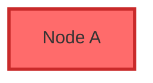

[**Catalyst UI API Documentation v1.4.0**](../../../README.md)

---

[Catalyst UI API Documentation](../../../README.md) / [mermaid/types](../README.md) / ParsedClass

# Interface: ParsedClass

Defined in: [workspace/catalyst-ui/lib/utils/mermaid/types.ts:282](https://github.com/TheBranchDriftCatalyst/catalyst-ui/blob/main/lib/utils/mermaid/types.ts#L282)

Parsed class definition

Represents a CSS class definition from Mermaid's `classDef` directive.
Classes can be applied to nodes for custom styling.

## Examples

```typescript
const classStyle: ParsedClass = {
  name: "critical",
  fill: "#ff6b6b",
  stroke: "#c92a2a",
  strokeWidth: "3px",
};
```



## Indexable

\[`key`: `string`\]: `undefined` \| `string`

## Properties

### name

> **name**: `string`

Defined in: [workspace/catalyst-ui/lib/utils/mermaid/types.ts:283](https://github.com/TheBranchDriftCatalyst/catalyst-ui/blob/main/lib/utils/mermaid/types.ts#L283)

Class name

---

### fill?

> `optional` **fill**: `string`

Defined in: [workspace/catalyst-ui/lib/utils/mermaid/types.ts:284](https://github.com/TheBranchDriftCatalyst/catalyst-ui/blob/main/lib/utils/mermaid/types.ts#L284)

Background color

---

### stroke?

> `optional` **stroke**: `string`

Defined in: [workspace/catalyst-ui/lib/utils/mermaid/types.ts:285](https://github.com/TheBranchDriftCatalyst/catalyst-ui/blob/main/lib/utils/mermaid/types.ts#L285)

Border color

---

### strokeWidth?

> `optional` **strokeWidth**: `string`

Defined in: [workspace/catalyst-ui/lib/utils/mermaid/types.ts:286](https://github.com/TheBranchDriftCatalyst/catalyst-ui/blob/main/lib/utils/mermaid/types.ts#L286)

Border width
