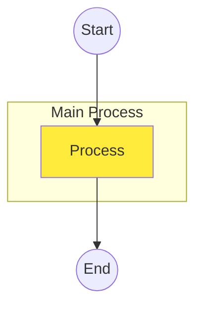

[**Catalyst UI API Documentation v1.4.0**](../../../README.md)

---

[Catalyst UI API Documentation](../../../README.md) / [mermaid/types](../README.md) / ParsedMermaid

# Interface: ParsedMermaid

Defined in: [workspace/catalyst-ui/lib/utils/mermaid/types.ts:336](https://github.com/TheBranchDriftCatalyst/catalyst-ui/blob/main/lib/utils/mermaid/types.ts#L336)

Complete parsed Mermaid flowchart

The top-level structure returned by the parser, containing all parsed elements.

## Examples

```typescript
const parsed: ParsedMermaid = {
  direction: "TB",
  nodes: [
    { id: "start", label: "Start", shape: "circle" },
    { id: "process", label: "Process", shape: "rectangle", subgraph: "main" },
    { id: "end", label: "End", shape: "circle" },
  ],
  edges: [
    { src: "start", dst: "process", type: "solid", bidirectional: false },
    { src: "process", dst: "end", type: "solid", bidirectional: false },
  ],
  subgraphs: [{ id: "main", title: "Main Process", nodeIds: ["process"] }],
  classes: [{ name: "highlight", fill: "#ffeb3b" }],
};
```



## Properties

### direction

> **direction**: [`FlowDirection`](../type-aliases/FlowDirection.md)

Defined in: [workspace/catalyst-ui/lib/utils/mermaid/types.ts:337](https://github.com/TheBranchDriftCatalyst/catalyst-ui/blob/main/lib/utils/mermaid/types.ts#L337)

Primary flow direction

---

### nodes

> **nodes**: [`ParsedNode`](ParsedNode.md)[]

Defined in: [workspace/catalyst-ui/lib/utils/mermaid/types.ts:338](https://github.com/TheBranchDriftCatalyst/catalyst-ui/blob/main/lib/utils/mermaid/types.ts#L338)

All parsed nodes

---

### edges

> **edges**: [`ParsedEdge`](ParsedEdge.md)[]

Defined in: [workspace/catalyst-ui/lib/utils/mermaid/types.ts:339](https://github.com/TheBranchDriftCatalyst/catalyst-ui/blob/main/lib/utils/mermaid/types.ts#L339)

All parsed edges

---

### subgraphs

> **subgraphs**: [`ParsedSubgraph`](ParsedSubgraph.md)[]

Defined in: [workspace/catalyst-ui/lib/utils/mermaid/types.ts:340](https://github.com/TheBranchDriftCatalyst/catalyst-ui/blob/main/lib/utils/mermaid/types.ts#L340)

All parsed subgraphs

---

### classes

> **classes**: [`ParsedClass`](ParsedClass.md)[]

Defined in: [workspace/catalyst-ui/lib/utils/mermaid/types.ts:341](https://github.com/TheBranchDriftCatalyst/catalyst-ui/blob/main/lib/utils/mermaid/types.ts#L341)

All class definitions
