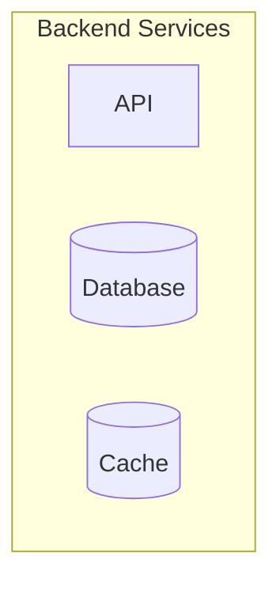

[**Catalyst UI API Documentation v1.4.0**](../../../README.md)

---

[Catalyst UI API Documentation](../../../README.md) / [mermaid/types](../README.md) / ParsedSubgraph

# Interface: ParsedSubgraph

Defined in: [workspace/catalyst-ui/lib/utils/mermaid/types.ts:245](https://github.com/TheBranchDriftCatalyst/catalyst-ui/blob/main/lib/utils/mermaid/types.ts#L245)

Parsed subgraph (group/fence)

Represents a logical grouping of nodes in the flowchart.
Subgraphs can have their own direction and are used for visual organization.

## Examples

```typescript
const subgraph: ParsedSubgraph = {
  id: "frontend",
  title: "Frontend Services",
  direction: "LR",
  nodeIds: ["ui", "state", "router"],
};
```



## Properties

### id

> **id**: `string`

Defined in: [workspace/catalyst-ui/lib/utils/mermaid/types.ts:246](https://github.com/TheBranchDriftCatalyst/catalyst-ui/blob/main/lib/utils/mermaid/types.ts#L246)

Unique subgraph identifier (sanitized from title)

---

### title

> **title**: `string`

Defined in: [workspace/catalyst-ui/lib/utils/mermaid/types.ts:247](https://github.com/TheBranchDriftCatalyst/catalyst-ui/blob/main/lib/utils/mermaid/types.ts#L247)

Display title for the subgraph

---

### direction?

> `optional` **direction**: [`FlowDirection`](../type-aliases/FlowDirection.md)

Defined in: [workspace/catalyst-ui/lib/utils/mermaid/types.ts:248](https://github.com/TheBranchDriftCatalyst/catalyst-ui/blob/main/lib/utils/mermaid/types.ts#L248)

Optional flow direction override for this subgraph

---

### nodeIds

> **nodeIds**: `string`[]

Defined in: [workspace/catalyst-ui/lib/utils/mermaid/types.ts:249](https://github.com/TheBranchDriftCatalyst/catalyst-ui/blob/main/lib/utils/mermaid/types.ts#L249)

Array of node IDs contained in this subgraph
