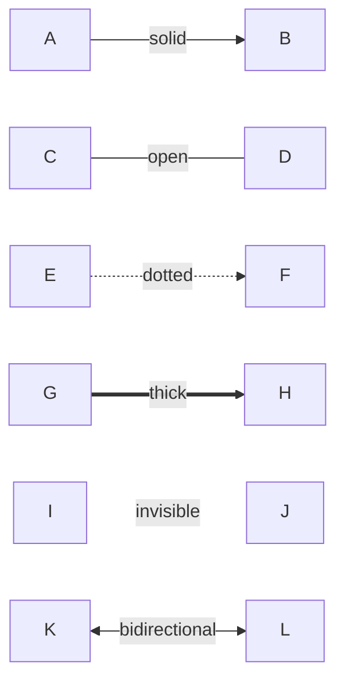

[**Catalyst UI API Documentation v1.4.0**](../../../README.md)

---

[Catalyst UI API Documentation](../../../README.md) / [mermaid/types](../README.md) / EdgeType

# Type Alias: EdgeType

> **EdgeType** = `"solid"` \| `"open"` \| `"dotted"` \| `"thick"` \| `"invisible"`

Defined in: [workspace/catalyst-ui/lib/utils/mermaid/types.ts:103](https://github.com/TheBranchDriftCatalyst/catalyst-ui/blob/main/lib/utils/mermaid/types.ts#L103)

Edge/arrow types supported by Mermaid flowcharts

Each edge type has a specific arrow syntax:

- `solid`: Standard arrow `-->`
- `open`: Line without arrow `---`
- `dotted`: Dashed arrow `-.->` (for data flow)
- `thick`: Bold arrow `==>` (for emphasis)
- `invisible`: Hidden link `~~~` (for layout spacing)

## Example

