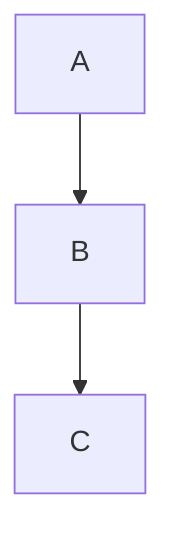
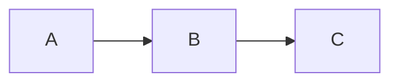

[**Catalyst UI API Documentation v1.4.0**](../../../README.md)

---

[Catalyst UI API Documentation](../../../README.md) / [mermaid/types](../README.md) / FlowDirection

# Type Alias: FlowDirection

> **FlowDirection** = `"TB"` \| `"TD"` \| `"BT"` \| `"LR"` \| `"RL"`

Defined in: [workspace/catalyst-ui/lib/utils/mermaid/types.ts:130](https://github.com/TheBranchDriftCatalyst/catalyst-ui/blob/main/lib/utils/mermaid/types.ts#L130)

Flow direction for Mermaid flowcharts

Determines the primary layout direction:

- `TB` / `TD`: Top to bottom (default)
- `BT`: Bottom to top
- `LR`: Left to right
- `RL`: Right to left

## Example

