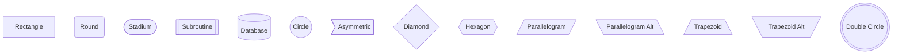

[**Catalyst UI API Documentation v1.4.0**](../../../README.md)

---

[Catalyst UI API Documentation](../../../README.md) / [mermaid/types](../README.md) / NodeShape

# Type Alias: NodeShape

> **NodeShape** = `"rectangle"` \| `"round"` \| `"stadium"` \| `"subroutine"` \| `"database"` \| `"circle"` \| `"asymmetric"` \| `"diamond"` \| `"hexagon"` \| `"parallelogram"` \| `"parallelogram_alt"` \| `"trapezoid"` \| `"trapezoid_alt"` \| `"double_circle"`

Defined in: [workspace/catalyst-ui/lib/utils/mermaid/types.ts:66](https://github.com/TheBranchDriftCatalyst/catalyst-ui/blob/main/lib/utils/mermaid/types.ts#L66)

Node shape types supported by Mermaid flowcharts

Each shape has a specific syntax in Mermaid:

- `rectangle`: Standard box `[text]`
- `round`: Rounded corners `(text)`
- `stadium`: Pill shape `([text])`
- `subroutine`: Double-line box `[[text]]`
- `database`: Cylinder shape `[(text)]`
- `circle`: Circle `((text))`
- `asymmetric`: Flag shape `>text]`
- `diamond`: Decision diamond `{text}`
- `hexagon`: Hexagon `{{text}}`
- `parallelogram`: Input/output shape `[/text/]`
- `parallelogram_alt`: Alternative parallelogram `[\text\]`
- `trapezoid`: Trapezoid `[/text\]`
- `trapezoid_alt`: Alternative trapezoid `[\text/]`
- `double_circle`: Double circle `(((text)))`

## Example

