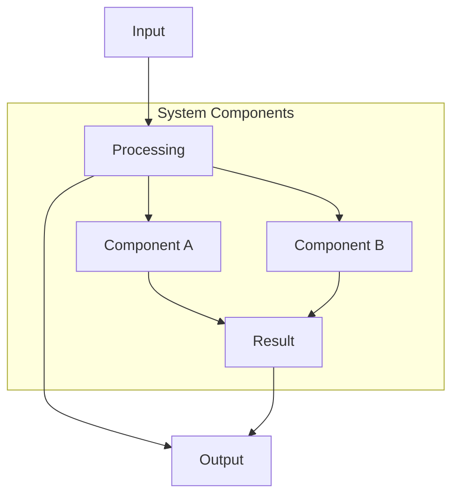

# [Feature Name]

## Overview

Brief description of what this feature accomplishes and why it's needed.

### Vision

What is the ideal end-state? What problem does this solve?

### Key Differentiators

What makes this implementation unique or better than alternatives?

1. **First Differentiator**: Why this matters
2. **Second Differentiator**: How this helps
3. **Third Differentiator**: What makes it special

## Current State

### Existing Infrastructure We Can Leverage

✅ **Component/System Name** (`path/to/file`)
- What it does
- Why it's useful for this feature
- How we'll use it

✅ **Another Component** (`path/to/file`)
- Description
- Integration point

### What's Missing

❌ Thing we need to build
❌ Another missing piece
❌ Additional requirement

## Problem Statement (Optional)

If this is solving a specific problem, describe it here.

### Current Behavior
- ✅ **What Works**: Description
- ❌ **What Doesn't**: Description

### Error/Issue
```
Error messages or problem manifestation
```

## Proposed Architecture

### System Diagram



### Data Flow

```typescript
// Example of how data flows through the system
const input = someFunction();
// → [{ output structure }]

const transformed = transform(input);
// → { type: 'something', data: [...] }

const rendered = render(transformed);
// → <Component>...</Component>
```

## Implementation Plan

### Phase 1: [Phase Name]

#### Step 1: [Step Name]

**File**: `path/to/file.ts`

```typescript
// Code example showing what to implement
interface Example {
  property: string;
}

export function exampleFunction(): Example {
  return { property: 'value' };
}
```

**Purpose**: Why this step matters

#### Step 2: [Next Step]

**File**: `path/to/next-file.tsx`

```typescript
// More implementation details
```

### Phase 2: [Next Phase]

Continue with additional phases as needed...

## Features

### Core Features ✅

- **Feature 1**: Description
- **Feature 2**: Description
- **Feature 3**: Description

### Advanced Features (Future)

- **Advanced 1**: Description
- **Advanced 2**: Description

## API Design

### Component Props

```typescript
export interface ComponentNameProps {
  /** Description of prop */
  propName: string;

  /** Optional prop with default */
  optionalProp?: boolean; // default: false

  /** Callback function */
  onSomething?: (data: SomeType) => void;
}
```

### Usage Examples

```typescript
import { ComponentName } from 'catalyst-ui';

// Basic usage
<ComponentName
  propName="value"
/>

// Advanced usage
<ComponentName
  propName="value"
  optionalProp={true}
  onSomething={handleData}
/>
```

## File Structure

```
project-root/
├── lib/
│   ├── components/
│   │   └── FeatureName/
│   │       ├── Component.tsx
│   │       ├── Component.stories.tsx
│   │       └── index.ts
│   ├── hooks/
│   │   └── useFeature.ts
│   ├── utils/
│   │   └── feature-utils/
│   │       ├── helper.ts
│   │       ├── types.ts
│   │       └── index.ts
│   └── types/
│       └── feature.d.ts
├── app/
│   └── tabs/
│       └── FeatureTab.tsx
└── docs/
    └── features/
        └── feature-name.md  # This file
```

## Expected Output

### Example 1: [Scenario]

**Input:**
```
Input data or code
```

**Output:**
```
Expected output
```

### Example 2: [Another Scenario]

**Input:**
```
Different input
```

**Output:**
```
Different output
```

## Benefits

- ✅ Benefit 1
- ✅ Benefit 2
- ✅ Benefit 3
- ✅ Single source of truth
- ✅ Type-safe
- ✅ Performant

## Future Enhancements

### Phase 2 Features

- [ ] **Enhancement 1**: Description and why it's valuable
- [ ] **Enhancement 2**: Another improvement
- [ ] **Enhancement 3**: Future capability

### Advanced Features

- [ ] **Advanced Feature 1**: Long-term goal
- [ ] **Advanced Feature 2**: Nice-to-have
- [ ] **Advanced Feature 3**: Ambitious feature

### Developer Experience

- [ ] **DX Improvement 1**: Tooling enhancement
- [ ] **DX Improvement 2**: Better debugging
- [ ] **DX Improvement 3**: Easier testing

## Dependencies

### Required

```json
{
  "dependencies": {
    "package-name": "^1.0.0",
    "another-package": "^2.0.0"
  },
  "devDependencies": {
    "@types/package-name": "^1.0.0"
  }
}
```

### Already Installed

- ✅ `existing-package` - What it's used for
- ✅ `another-existing` - Its purpose

## Known Issues

### Issue Name

- **Issue**: Description of the problem
- **Mitigation**: How we handle it
- **Status**: Current state (e.g., "Gracefully degraded")

## Testing Checklist

### Phase 1: [Component/Feature Name]

- [ ] Test case 1
- [ ] Test case 2
- [ ] Test case 3
- [ ] Error handling works
- [ ] Edge cases covered

### Phase 2: [Integration Tests]

- [ ] Integration test 1
- [ ] Integration test 2
- [ ] No console errors
- [ ] Performance acceptable

### Phase 3: [Production Readiness]

- [ ] Works in all themes
- [ ] Responsive design verified
- [ ] Accessibility checks pass
- [ ] Documentation updated

## Alternative Approaches

### Alternative 1: [Name]

**Description**: What this approach would do differently

**Pros:**
- Advantage 1
- Advantage 2

**Cons:**
- Disadvantage 1
- Disadvantage 2

**Decision**: Why we chose or didn't choose this

## Resources

- [Documentation Link](https://example.com)
- [Related GitHub Issue](https://github.com/user/repo/issues/123)
- Internal file: `lib/path/to/related-file.ts`
- API reference: [Service Name](https://api.example.com)

## Status

- [ ] Problem identified
- [ ] Solution designed
- [ ] Feature proposal documented
- [ ] Dependencies installed
- [ ] Implementation started
- [ ] Core features complete
- [ ] Tests passing
- [ ] Integration complete
- [ ] Documentation updated
- [ ] Production ready

---

## Implementation Notes

### [Date] - [Author]

Notes about implementation decisions, challenges encountered, or important context for future maintainers.

### [Date] - [Author]

Additional updates or changes to the implementation plan.
