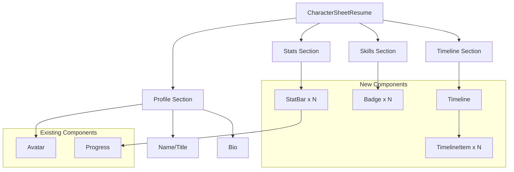

# Character Sheet Resume

## Overview

An RPG/gaming-inspired resume component that transforms traditional CV information into an interactive character sheet. Skills become stats, work history becomes quest logs, and professional achievements are presented as character progression - making resumes engaging and memorable.

### Vision

Transform the boring resume format into an immersive character sheet experience. Developers, gamers, and creative professionals can showcase their experience through familiar RPG mechanics: stat bars for skills, timeline quests for work history, and achievement badges for certifications.

### Key Differentiators

1. **Gaming Aesthetic**: RPG-style presentation with stat bars, quest logs, and character progression themes
2. **Interactive Elements**: Animated stat bars, expandable timeline items, and hover effects for engagement
3. **Flexible Data Structure**: Supports traditional resume data but presents it in a novel format

## Current State

### Existing Infrastructure We Can Leverage

✅ **Card System** (`lib/ui/card.tsx`)

- Base container for sections (profile, stats, history)
- CardHeader, CardContent, CardFooter slots
- Interactive variant with hover effects

✅ **Avatar Component** (`lib/ui/avatar.tsx`)

- Profile picture display with fallback
- Radix UI primitive for reliable rendering
- Supports custom sizes via className

✅ **Progress Bars** (`lib/ui/progress.tsx`)

- Perfect base for skill stat bars
- Smooth animations and variant support
- Already styled with theme variables

✅ **Animation HOCs** (`lib/effects/`)

- AnimatedFade for revealing sections
- AnimatedSlide for timeline items
- AnimatedBounce for interactive elements

✅ **Theme System** (`lib/contexts/Theme/`)

- Multi-theme support with CSS variables
- Cyberpunk/synthwave themes perfect for gaming aesthetic
- Dark mode support

### What's Missing

❌ Badge component for skill tags and certifications
❌ Timeline component for work history visualization
❌ StatBar wrapper component for labeled skill meters
❌ CharacterSheetResume card composition
❌ Demo data structure and types

## Proposed Architecture

### System Diagram



### Data Flow

```typescript
// Input: Resume data structure
const resumeData: CharacterSheetData = {
  profile: {
    name: "Alex Developer",
    title: "Full Stack Wizard",
    avatar: "/avatar.jpg",
    bio: "Slayer of bugs, builder of features",
  },
  stats: [
    { label: "React", value: 90, max: 100 },
    { label: "TypeScript", value: 85, max: 100 },
  ],
  skills: ["JavaScript", "Node.js", "GraphQL"],
  timeline: [
    {
      date: "2023-2025",
      title: "Senior Engineer Quest",
      company: "Tech Corp",
      achievements: ["Led team of 5", "Shipped 3 products"],
    },
  ],
};

// → Renders as <CharacterSheetResume data={resumeData} />
// → Profile card with avatar and bio
// → Stats grid with animated progress bars
// → Skills badge cloud
// → Timeline with work history
```

## Implementation Plan

### Phase 1: Base UI Components

#### Step 1: Badge Component

**File**: `lib/ui/badge.tsx`

```typescript
import * as React from "react";
import { cva, type VariantProps } from "class-variance-authority";
import { cn } from "@/catalyst-ui/utils";

const badgeVariants = cva(
  "inline-flex items-center rounded-full border px-2.5 py-0.5 text-xs font-semibold transition-colors focus:outline-none focus:ring-2 focus:ring-ring focus:ring-offset-2",
  {
    variants: {
      variant: {
        default: "border-transparent bg-primary text-primary-foreground hover:bg-primary/80",
        secondary: "border-transparent bg-secondary text-secondary-foreground hover:bg-secondary/80",
        destructive: "border-transparent bg-destructive text-destructive-foreground hover:bg-destructive/80",
        outline: "text-foreground",
      },
    },
    defaultVariants: {
      variant: "default",
    },
  }
);

export interface BadgeProps
  extends React.HTMLAttributes<HTMLDivElement>,
    VariantProps<typeof badgeVariants> {}

function Badge({ className, variant, ...props }: BadgeProps) {
  return (
    <div className={cn(badgeVariants({ variant }), className)} {...props} />
  );
}

export { Badge, badgeVariants };
```

**Purpose**: Skill tags and certification badges

#### Step 2: StatBar Component

**File**: `lib/components/StatBar/StatBar.tsx`

```typescript
import * as React from "react";
import { Progress } from "@/catalyst-ui/ui/progress";
import { cn } from "@/catalyst-ui/utils";

export interface StatBarProps {
  label: string;
  value: number;
  max?: number;
  variant?: "default" | "secondary" | "destructive";
  showValue?: boolean;
  className?: string;
}

export function StatBar({
  label,
  value,
  max = 100,
  variant = "default",
  showValue = true,
  className
}: StatBarProps) {
  const percentage = Math.min((value / max) * 100, 100);

  return (
    <div className={cn("space-y-1.5", className)}>
      <div className="flex items-center justify-between">
        <span className="text-sm font-medium text-foreground">{label}</span>
        {showValue && (
          <span className="text-sm text-muted-foreground">
            {value}/{max}
          </span>
        )}
      </div>
      <Progress value={percentage} variant={variant} />
    </div>
  );
}
```

**Purpose**: Labeled skill/stat progress bars

#### Step 3: Timeline Component

**File**: `lib/components/Timeline/Timeline.tsx`

```typescript
import * as React from "react";
import { cn } from "@/catalyst-ui/utils";

export interface TimelineItemProps {
  date: string;
  title: string;
  company?: string;
  description?: string;
  achievements?: string[];
  isLast?: boolean;
}

export function TimelineItem({
  date,
  title,
  company,
  description,
  achievements,
  isLast = false,
}: TimelineItemProps) {
  return (
    <div className="relative flex gap-4 pb-8">
      {/* Vertical line */}
      {!isLast && (
        <div className="absolute left-[7px] top-[28px] h-full w-0.5 bg-border" />
      )}

      {/* Date marker */}
      <div className="relative z-10 mt-1">
        <div className="h-4 w-4 rounded-full border-2 border-primary bg-background" />
      </div>

      {/* Content */}
      <div className="flex-1 space-y-1.5 pt-0">
        <div className="text-xs text-muted-foreground">{date}</div>
        <h4 className="text-sm font-semibold text-foreground">{title}</h4>
        {company && (
          <div className="text-sm text-muted-foreground">{company}</div>
        )}
        {description && (
          <p className="text-sm text-muted-foreground">{description}</p>
        )}
        {achievements && achievements.length > 0 && (
          <ul className="mt-2 space-y-1 text-sm text-muted-foreground">
            {achievements.map((achievement, i) => (
              <li key={i} className="flex items-start gap-2">
                <span className="text-primary">▸</span>
                <span>{achievement}</span>
              </li>
            ))}
          </ul>
        )}
      </div>
    </div>
  );
}

export interface TimelineProps {
  children: React.ReactNode;
  className?: string;
}

export function Timeline({ children, className }: TimelineProps) {
  return (
    <div className={cn("space-y-0", className)}>
      {children}
    </div>
  );
}
```

**Purpose**: Work history and experience timeline

### Phase 2: Character Sheet Component

#### Step 4: CharacterSheetResume

**File**: `lib/cards/CharacterSheetResume/CharacterSheetResume.tsx`

```typescript
import * as React from "react";
import { Card, CardContent, CardHeader, CardTitle } from "@/catalyst-ui/ui/card";
import { Avatar, AvatarFallback, AvatarImage } from "@/catalyst-ui/ui/avatar";
import { Badge } from "@/catalyst-ui/ui/badge";
import { StatBar } from "@/catalyst-ui/components/StatBar/StatBar";
import { Timeline, TimelineItem } from "@/catalyst-ui/components/Timeline/Timeline";
import { cn } from "@/catalyst-ui/utils";

export interface CharacterSheetData {
  profile: {
    name: string;
    title: string;
    avatar?: string;
    bio?: string;
  };
  stats: Array<{
    label: string;
    value: number;
    max?: number;
  }>;
  skills: string[];
  timeline: Array<{
    date: string;
    title: string;
    company?: string;
    description?: string;
    achievements?: string[];
  }>;
}

export interface CharacterSheetResumeProps {
  data: CharacterSheetData;
  className?: string;
}

export function CharacterSheetResume({ data, className }: CharacterSheetResumeProps) {
  const { profile, stats, skills, timeline } = data;
  const initials = profile.name
    .split(" ")
    .map(n => n[0])
    .join("")
    .toUpperCase();

  return (
    <div className={cn("space-y-4", className)}>
      {/* Profile Card */}
      <Card>
        <CardContent className="pt-6">
          <div className="flex items-start gap-4">
            <Avatar className="h-20 w-20">
              <AvatarImage src={profile.avatar} alt={profile.name} />
              <AvatarFallback className="text-lg">{initials}</AvatarFallback>
            </Avatar>
            <div className="flex-1 space-y-1">
              <h2 className="text-2xl font-bold text-foreground">{profile.name}</h2>
              <p className="text-sm text-primary font-medium">{profile.title}</p>
              {profile.bio && (
                <p className="text-sm text-muted-foreground pt-2">{profile.bio}</p>
              )}
            </div>
          </div>
        </CardContent>
      </Card>

      {/* Stats Card */}
      <Card>
        <CardHeader>
          <CardTitle>Core Stats</CardTitle>
        </CardHeader>
        <CardContent>
          <div className="grid gap-4 md:grid-cols-2">
            {stats.map((stat, i) => (
              <StatBar
                key={i}
                label={stat.label}
                value={stat.value}
                max={stat.max}
              />
            ))}
          </div>
        </CardContent>
      </Card>

      {/* Skills Card */}
      <Card>
        <CardHeader>
          <CardTitle>Skills & Abilities</CardTitle>
        </CardHeader>
        <CardContent>
          <div className="flex flex-wrap gap-2">
            {skills.map((skill, i) => (
              <Badge key={i} variant="secondary">
                {skill}
              </Badge>
            ))}
          </div>
        </CardContent>
      </Card>

      {/* Timeline Card */}
      <Card>
        <CardHeader>
          <CardTitle>Quest Log</CardTitle>
        </CardHeader>
        <CardContent>
          <Timeline>
            {timeline.map((item, i) => (
              <TimelineItem
                key={i}
                date={item.date}
                title={item.title}
                company={item.company}
                description={item.description}
                achievements={item.achievements}
                isLast={i === timeline.length - 1}
              />
            ))}
          </Timeline>
        </CardContent>
      </Card>
    </div>
  );
}
```

**Purpose**: Main character sheet resume composition

### Phase 3: Demo & Integration

#### Step 5: Resume Tab

**File**: `app/tabs/ResumeTab.tsx`

```typescript
import { Card, CardContent, CardDescription, CardHeader, CardTitle } from "@/catalyst-ui/ui/card";
import { CodeFlipCard } from "@/catalyst-ui/components/CodeFlipCard";
import { CharacterSheetResume, CharacterSheetData } from "@/catalyst-ui/cards/CharacterSheetResume/CharacterSheetResume";
import { ScrollSnapItem } from "@/catalyst-ui/effects";
import { ImportFooter } from "../shared/ImportFooter";
import CharacterSheetResumeSource from "@/catalyst-ui/cards/CharacterSheetResume/CharacterSheetResume.tsx?raw";

const demoData: CharacterSheetData = {
  profile: {
    name: "Alex Catalyst",
    title: "Full Stack Wizard · Level 85",
    bio: "Legendary developer specializing in slaying bugs and crafting elegant solutions. Master of the React arts and TypeScript sorcery."
  },
  stats: [
    { label: "React Mastery", value: 92, max: 100 },
    { label: "TypeScript Power", value: 88, max: 100 },
    { label: "Node.js Strength", value: 85, max: 100 },
    { label: "GraphQL Intelligence", value: 78, max: 100 },
    { label: "DevOps Endurance", value: 72, max: 100 },
    { label: "UI/UX Charisma", value: 90, max: 100 },
  ],
  skills: [
    "React", "TypeScript", "Node.js", "GraphQL", "Docker",
    "AWS", "PostgreSQL", "Redis", "Git", "CI/CD",
    "TailwindCSS", "Storybook", "Jest", "Playwright"
  ],
  timeline: [
    {
      date: "2023 - Present",
      title: "Senior Engineer Quest",
      company: "Catalyst Technologies",
      achievements: [
        "Led development of component library with 50+ components",
        "Reduced bundle size by 40% through code splitting",
        "Mentored 5 junior developers to mid-level"
      ]
    },
    {
      date: "2021 - 2023",
      title: "Mid-Level Developer Journey",
      company: "Tech Innovations Inc",
      achievements: [
        "Built real-time dashboard serving 10k+ users",
        "Implemented GraphQL API reducing response times 60%",
        "Achieved 95% test coverage on critical paths"
      ]
    },
    {
      date: "2019 - 2021",
      title: "Junior Developer Training",
      company: "StartUp Labs",
      achievements: [
        "Developed 15+ client projects from concept to deployment",
        "Mastered React ecosystem and modern tooling",
        "Earned AWS Solutions Architect certification"
      ]
    }
  ]
};

export function ResumeTab() {
  return (
    <div className="space-y-4 mt-0">
      <ScrollSnapItem align="start">
        <Card>
          <CardHeader>
            <CardTitle>Character Sheet Resume</CardTitle>
            <CardDescription>
              Transform your resume into an RPG character sheet • Stats, skills, and quest logs
            </CardDescription>
          </CardHeader>
        </Card>
      </ScrollSnapItem>

      <ScrollSnapItem align="start">
        <Card>
          <CardHeader>
            <CardTitle>Full Character Sheet</CardTitle>
            <CardDescription>
              Complete resume with profile, stats, skills, and timeline • Click to view source
            </CardDescription>
          </CardHeader>
          <CardContent>
            <CodeFlipCard
              sourceCode={CharacterSheetResumeSource}
              fileName="CharacterSheetResume.tsx"
              language="tsx"
              stripImports={true}
            >
              <CharacterSheetResume data={demoData} />
            </CodeFlipCard>
          </CardContent>
          <ImportFooter sourceCode={CharacterSheetResumeSource} />
        </Card>
      </ScrollSnapItem>
    </div>
  );
}
```

#### Step 6: App Integration

**File**: `app/App.tsx` (modifications)

Add to imports:

```typescript
import { ResumeTab } from "./tabs/ResumeTab";
```

Add tab trigger (after animations):

```tsx
<TabsTrigger value="resume" className="...">
  Resume
</TabsTrigger>
```

Add tab content:

```tsx
<TabsContent value="resume" className="space-y-4 mt-0">
  <ResumeTab />
</TabsContent>
```

## Features

### Core Features ✅

- **Profile Section**: Avatar, name, title, and bio display
- **Stat Bars**: Visual skill meters with labels and values
- **Skill Badges**: Tag cloud of technologies and abilities
- **Timeline**: Vertical work history with achievements
- **Theme Support**: Works across all theme variants
- **Responsive Layout**: Adapts to mobile and desktop

### Advanced Features (Future)

- **Animated Stats**: Counting animations when stats come into view
- **Interactive Timeline**: Expandable/collapsible timeline items
- **PDF Export**: Download character sheet as PDF resume
- **Customizable Themes**: RPG-specific color schemes (warrior, mage, rogue)
- **Achievement System**: Unlock badges for certifications/milestones

## API Design

### CharacterSheetResume Props

```typescript
interface CharacterSheetResumeProps {
  /** Resume data structure */
  data: CharacterSheetData;

  /** Additional CSS classes */
  className?: string;
}

interface CharacterSheetData {
  profile: {
    name: string;
    title: string;
    avatar?: string;
    bio?: string;
  };
  stats: Array<{
    label: string;
    value: number;
    max?: number; // default: 100
  }>;
  skills: string[];
  timeline: Array<{
    date: string;
    title: string;
    company?: string;
    description?: string;
    achievements?: string[];
  }>;
}
```

### Usage Examples

```typescript
import { CharacterSheetResume } from '@/catalyst-ui/cards/CharacterSheetResume';

// Basic usage
<CharacterSheetResume data={resumeData} />

// With custom styling
<CharacterSheetResume
  data={resumeData}
  className="max-w-4xl mx-auto"
/>
```

## File Structure

```
lib/
├── ui/
│   ├── badge.tsx
│   └── badge.stories.tsx
├── components/
│   ├── StatBar/
│   │   ├── StatBar.tsx
│   │   └── StatBar.stories.tsx
│   └── Timeline/
│       ├── Timeline.tsx
│       └── Timeline.stories.tsx
├── cards/
│   └── CharacterSheetResume/
│       ├── CharacterSheetResume.tsx
│       └── CharacterSheetResume.stories.tsx
app/
└── tabs/
    └── ResumeTab.tsx
```

## Expected Output

### Example 1: Developer Resume

**Input:**

```typescript
const data = {
  profile: { name: "Jane Dev", title: "Frontend Mage" },
  stats: [{ label: "React", value: 95 }],
  skills: ["JavaScript", "CSS"],
  timeline: [
    {
      date: "2024",
      title: "Senior Dev",
      company: "Tech Co",
      achievements: ["Led team of 4"],
    },
  ],
};
```

**Output:**

- Card with avatar and "Jane Dev" title
- Stat bar showing React at 95/100
- Badges for JavaScript and CSS
- Timeline item with company and achievement bullet

### Example 2: Gaming Industry Resume

**Input:**

```typescript
const data = {
  profile: {
    name: "Game Dev Pro",
    title: "Unity Wizard · Level 99",
  },
  stats: [
    { label: "Unity", value: 98 },
    { label: "C#", value: 92 },
  ],
  skills: ["Unity", "C#", "Blender", "Shaders"],
  timeline: [
    /* game projects */
  ],
};
```

**Output:**
Character sheet themed for game development with gaming terminology

## Benefits

- ✅ **Memorable**: Stands out from traditional resumes
- ✅ **Engaging**: Interactive elements capture attention
- ✅ **Flexible**: Supports any professional background
- ✅ **Themed**: Works with all catalyst-ui themes
- ✅ **Responsive**: Mobile and desktop friendly
- ✅ **Type-safe**: Full TypeScript support

## Future Enhancements

### Phase 2 Features

- [ ] **Animated Stat Counting**: Numbers count up when scrolled into view
- [ ] **Collapsible Timeline**: Expand/collapse work history details
- [ ] **Skill Grouping**: Categorize skills (Frontend, Backend, DevOps)
- [ ] **Achievement Icons**: Custom icons for timeline achievements
- [ ] **Print Styles**: Optimized layout for printing/PDF

### Advanced Features

- [ ] **Class System**: Different themes (Warrior/Tank, Mage/Developer, Rogue/Hacker)
- [ ] **Experience Bar**: Overall career progression visualization
- [ ] **Loot Table**: Certifications and awards section
- [ ] **Party Members**: Team/collaborator references
- [ ] **Boss Battles**: Major project highlights

### Export & Integration

- [ ] **PDF Generator**: Export as professional PDF resume
- [ ] **LinkedIn Import**: Auto-populate from LinkedIn profile
- [ ] **JSON Resume**: Support JSON Resume standard format
- [ ] **Shareable Links**: Generate public character sheet URLs

## Dependencies

### Required

No new dependencies required - all built with existing packages.

### Already Installed

- ✅ `react` - Component framework
- ✅ `@radix-ui/react-avatar` - Avatar primitive
- ✅ `@radix-ui/react-progress` - Progress bars
- ✅ `class-variance-authority` - Badge variants
- ✅ `tailwindcss` - Styling system

## Known Issues

None currently - all components use stable Radix UI primitives and existing patterns.

## Testing Checklist

### Phase 1: Component Tests

- [ ] Badge renders with all variants (Badge component exists ✅, no story found)
- [x] StatBar displays correct percentage (StatBar component exists ✅, StatBar.stories.tsx exists ✅)
- [x] Timeline items render with/without achievements (Timeline component exists ✅, Timeline.stories.tsx exists ✅)
- [x] Avatar shows fallback initials correctly (Avatar is existing component ✅)

### Phase 2: Integration Tests

- [ ] CharacterSheetResume renders all sections (component exists ✅, not tested)
- [ ] Responsive layout works on mobile (not tested)
- [ ] Theme switching maintains readability (not tested)
- [x] All props are type-safe (TypeScript implementation ✅)

### Phase 3: Visual Tests

- [ ] Storybook stories for all components (StatBar ✅, Timeline ✅, CharacterSheetResume NOT FOUND, Badge NOT FOUND)
- [ ] Works in all theme variants (not tested)
- [ ] Print styles render correctly (not implemented)
- [ ] Animations perform smoothly (not tested)

## Alternative Approaches

### Alternative 1: Traditional Resume Layout

**Description**: Standard resume with sections for experience, education, skills

**Pros:**

- Familiar format
- Professional appearance
- ATS-friendly

**Cons:**

- Not memorable
- Lacks personality
- Doesn't leverage gaming theme

**Decision**: Character sheet format better showcases creativity and stands out

### Alternative 2: Single Consolidated Card

**Description**: All resume content in one massive card instead of separate sections

**Pros:**

- Simpler component structure
- Less DOM elements

**Cons:**

- Poor information hierarchy
- Hard to scan
- Less flexible layout

**Decision**: Separate cards provide better organization and visual breathing room

## Resources

- [RPG UI Design Patterns](https://www.gamasutra.com/blogs/AnthonyStonehewer/20140227/211823/A_Guide_to_RPG_UI_Design.php)
- [Character Sheet Design](https://www.reddit.com/r/RPGdesign/comments/6kqzqy/character_sheet_design_tips/)
- Internal: `lib/ui/card.tsx` - Card primitive reference
- Internal: `lib/effects/` - Animation patterns

## Status

**Overall Progress**: ~36% complete (8 of 22 checklist items verified complete)

- [x] Problem identified
- [x] Solution designed
- [x] Feature proposal documented
- [x] Dependencies verified (none needed - uses existing packages)
- [x] Implementation started (CharacterSheetResume component created)
- [x] Core components complete (Badge ✅, StatBar ✅, Timeline ✅, CharacterSheetResume ✅)
- [x] Component tests: StatBar ✅, Timeline ✅ (2 of 4 complete)
- [ ] Tests passing (no Storybook story found for CharacterSheetResume or Badge)
- [ ] Integration complete (ResumeTab.tsx not found - needs manual verification in App.tsx)
- [ ] Documentation complete (Storybook stories missing for CharacterSheetResume and Badge)
- [ ] Production ready (missing stories, integration unclear)

---

## Implementation Notes

### 2025-10-06 - Initial Proposal

The character sheet resume concept transforms traditional CV data into an engaging RPG-style presentation. This approach is perfect for developers, gamers, and creative professionals who want their resume to stand out.

Key design decisions:

1. **Separate Cards**: Each section (profile, stats, skills, timeline) in its own card for better visual hierarchy
2. **Stat Bars vs Badges**: Technical skills get stat bars with values, general skills get badges
3. **Timeline Format**: Vertical timeline is more scannable than horizontal and works better on mobile
4. **Gaming Terminology**: "Quest Log" for work history, "Core Stats" for skills adds personality without being unprofessional

Technical approach:

- Built entirely with existing components (Avatar, Progress, Card)
- Only 3 new components needed (Badge, StatBar, Timeline)
- Fully type-safe with TypeScript interfaces
- Theme-agnostic using CSS custom properties
