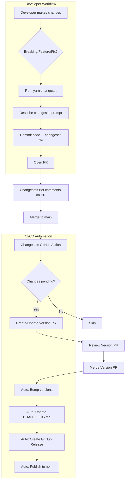

# Migrate from standard-version to Modern Release Automation

## Overview

Migrate from the deprecated `standard-version` package to a modern, actively maintained release automation tool. standard-version has been deprecated since 2022 and receives no updates, posing risks for future Node.js compatibility and security vulnerabilities.

### Vision

**Automated, reliable versioning and changelog generation** that works seamlessly across the catalyst-devspace monorepo while supporting individual package releases. The ideal solution should:

- Generate accurate changelogs from conventional commits
- Support both monorepo and standalone package workflows
- Integrate with existing GitHub workflows
- Provide flexibility for manual version overrides when needed
- Be actively maintained with a healthy community

### Key Differentiators

1. **Monorepo-First Design**: Unlike standard-version, modern tools like Changesets natively support monorepo workflows with independent versioning
2. **Active Maintenance**: Choosing tools with strong community backing ensures long-term compatibility and security
3. **GitHub-Native Integration**: Modern solutions integrate directly with GitHub PRs and releases for better visibility
4. **Backward Compatible**: Migration path preserves existing conventional commit workflow and CHANGELOG.md format

## Current State

### Existing Infrastructure We Can Leverage

✅ **Conventional Commits** (`package.json` - commitlint config)

- Already enforcing conventional commit messages via commitlint
- Team familiar with `feat:`, `fix:`, `chore:` prefixes
- Foundation for automated versioning

✅ **Husky Git Hooks** (`package.json` - husky, lint-staged)

- Pre-commit hooks already configured
- Can be extended for release workflow validation
- Ensures commit quality before releases

✅ **CHANGELOG.md Format** (`public/CHANGELOG.md`)

- Existing changelog copied to public directory during build
- Users expect this format
- New tool must maintain compatibility

✅ **NPM Scripts Structure** (`package.json` - release scripts)

- `release:first`, `release:patch`, `release:minor`, `release:major`
- Team familiar with this workflow
- New tool should provide similar DX

### What's Missing

❌ Active maintenance (standard-version deprecated since 2022)
❌ Monorepo support for coordinated releases across workspace
❌ GitHub PR integration for release previews
❌ Automated dependency bumping between workspace packages
❌ Visual release notes in GitHub Releases UI

## Problem Statement

### Current Behavior

- ✅ **What Works**: standard-version generates changelogs and bumps versions based on conventional commits
- ✅ **What Works**: NPM scripts provide clear release workflow
- ✅ **What Works**: Conventional commits enforced via commitlint
- ❌ **What Doesn't**: No updates since 2022, potential security/compatibility issues
- ❌ **What Doesn't**: No monorepo support for workspace-level coordination
- ❌ **What Doesn't**: Limited GitHub integration (no PR previews, manual release creation)
- ❌ **What Doesn't**: Cannot coordinate versions between catalyst-ui and other workspace packages

### Risk Assessment

**High Priority Risks:**

- **Security**: No patches for vulnerabilities discovered after 2022
- **Compatibility**: May break with Node.js 23+, future npm versions
- **Maintenance**: No bug fixes or feature updates

**Medium Priority Risks:**

- **Monorepo Growth**: As workspace adds packages, coordination becomes critical
- **Team Onboarding**: New developers may expect modern tooling (GitHub releases, PR automation)

## Alternative Tools Comparison

### Option 1: Changesets ⭐ **RECOMMENDED**

**GitHub**: [changesets/changesets](https://github.com/changesets/changesets) (8,563 stars, 670k weekly downloads)

**Pros:**

- ✅ **Best-in-class monorepo support** - Designed for multi-package repos
- ✅ **PR-based workflow** - Developers add `.changeset` files describing changes
- ✅ **Granular control** - Choose exactly which packages to version independently
- ✅ **GitHub integration** - Automatic PR comments, release notes
- ✅ **Active maintenance** - Regular updates, strong community
- ✅ **Flexible** - Works for both monorepos and single packages
- ✅ **Preserves conventional commits** - Can coexist with commitlint

**Cons:**

- ⚠️ Different workflow - Requires changeset files (small learning curve)
- ⚠️ Manual step - Developers must run `changeset add` before committing

**Best For:** Monorepos with multiple packages needing independent versioning (catalyst-devspace)

---

### Option 2: Release-Please

**GitHub**: [googleapis/release-please](https://github.com/googleapis/release-please) (Google-maintained)

**Pros:**

- ✅ **Fully automated** - No manual steps, purely commit-based
- ✅ **GitHub-native** - Creates release PRs automatically
- ✅ **Conventional commits** - Uses same format we already have
- ✅ **Monorepo support** - Via manifest config
- ✅ **Google backing** - Strong maintenance guarantee

**Cons:**

- ⚠️ GitHub Actions required - Tightly coupled to GitHub CI/CD
- ⚠️ Less control - Automated version bumps (can't easily override)
- ⚠️ Opinionated - Workflow is prescriptive

**Best For:** GitHub-centric teams wanting maximum automation

---

### Option 3: Semantic-Release

**GitHub**: [semantic-release/semantic-release](https://github.com/semantic-release/semantic-release) (22,310 stars, 2M weekly downloads)

**Pros:**

- ✅ **Most popular** - Industry standard for many projects
- ✅ **Fully automated** - Analyzes commits, versions, publishes
- ✅ **Extensive plugins** - npm, GitHub, GitLab, Slack, etc.
- ✅ **CI/CD focused** - Designed for automated pipelines

**Cons:**

- ❌ **Poor monorepo support** - Community plugins outdated (last update 2022)
- ⚠️ **All-or-nothing automation** - Difficult to override versions manually
- ⚠️ **Complex config** - Many plugins, steep learning curve
- ⚠️ **CI/CD required** - Not designed for local releases

**Best For:** Single-package repos with full CI/CD automation

---

### Option 4: commit-and-tag-version

**GitHub**: [absolute-version/commit-and-tag-version](https://github.com/absolute-version/commit-and-tag-version)

**Pros:**

- ✅ **Drop-in replacement** - Fork of standard-version with same API
- ✅ **Maintained** - Active updates, bug fixes
- ✅ **Zero migration cost** - Same commands, same workflow

**Cons:**

- ❌ **Still no monorepo support** - Same limitations as standard-version
- ⚠️ **Smaller community** - Less adoption, fewer resources
- ⚠️ **Tactical fix** - Doesn't solve underlying monorepo needs

**Best For:** Teams needing quick fix while planning bigger migration

## Proposed Architecture

### Recommended: Changesets Migration



### Data Flow

**Step 1: Developer adds changeset**

```bash
$ yarn changeset
🦋  Which packages would you like to include?
◉ catalyst-ui

🦋  What kind of change is this?
❯ patch (0.0.X)
  minor (0.X.0)
  major (X.0.0)

🦋  Please enter a summary for this change:
fix: resolve jerky dragging in ForceGraph after memoization

✅ Changeset added: .changeset/fuzzy-pandas-dance.md
```

**Generated changeset file:**

```markdown
---
"catalyst-ui": patch
---

fix: resolve jerky dragging in ForceGraph after memoization
```

**Step 2: Changesets bot comments on PR**

```
🦋 Changeset detected

This PR includes a changeset:
- catalyst-ui: patch (bug fix)

Summary: fix: resolve jerky dragging in ForceGraph after memoization
```

**Step 3: After merge, Version PR created**

```
Title: Version Packages

Changed packages:
- catalyst-ui: 1.2.1 → 1.2.2

CHANGELOG updates:
## 1.2.2
### Patch Changes
- fix: resolve jerky dragging in ForceGraph after memoization
```

**Step 4: Merge Version PR → Auto-release**

```
✅ Published catalyst-ui@1.2.2 to npm
✅ Created GitHub Release v1.2.2
✅ Updated CHANGELOG.md
```

## Implementation Plan

### Phase 1: Preparation (Low Risk)

#### Step 1: Install Changesets

**File**: `package.json`

```json
{
  "devDependencies": {
    "@changesets/cli": "^2.27.1",
    "@changesets/changelog-github": "^0.5.0"
  },
  "scripts": {
    "changeset": "changeset",
    "changeset:version": "changeset version",
    "changeset:publish": "changeset publish",
    "changeset:status": "changeset status"
  }
}
```

**Purpose**: Add changesets CLI without removing standard-version (safe coexistence)

#### Step 2: Initialize Changesets

**Command**:

```bash
yarn changeset init
```

**Generated**: `.changeset/config.json`

```json
{
  "$schema": "https://unpkg.com/@changesets/config@3.0.0/schema.json",
  "changelog": ["@changesets/changelog-github", { "repo": "TheBranchDriftCatalyst/catalyst-ui" }],
  "commit": false,
  "fixed": [],
  "linked": [],
  "access": "public",
  "baseBranch": "main",
  "updateInternalDependencies": "patch",
  "ignore": []
}
```

**Purpose**: Configure changesets for catalyst-ui with GitHub changelog

#### Step 3: Document New Workflow

**File**: `docs/development/workflow.md` (update)

```markdown
## Release Process

### Option 1: Changesets (Recommended)

1. Make your changes
2. Run `yarn changeset` and describe the change
3. Commit both code and `.changeset/*.md` file
4. Open PR - bot will comment with version preview
5. After merge, Version PR is auto-created
6. Review and merge Version PR → auto-publishes

### Option 2: Manual (Legacy - standard-version)

⚠️ **Deprecated**: standard-version is unmaintained. Use changesets instead.

1. `yarn release:patch` / `release:minor` / `release:major`
2. Review CHANGELOG.md changes
3. Push tags manually
```

**Purpose**: Guide team through new workflow while preserving old docs

### Phase 2: Gradual Migration

#### Step 1: Run Both Tools in Parallel (2-4 weeks)

**Strategy**:

- Keep `standard-version` scripts for emergencies
- Encourage team to use `yarn changeset` for new work
- Monitor adoption, gather feedback

**Success Criteria**:

- 5+ PRs using changesets successfully
- Team comfortable with workflow
- No blockers identified

#### Step 2: Set Up GitHub Action

**File**: `.github/workflows/release.yml`

```yaml
name: Release

on:
  push:
    branches:
      - main

concurrency: ${{ github.workflow }}-${{ github.ref }}

jobs:
  release:
    name: Release
    runs-on: ubuntu-latest
    steps:
      - name: Checkout Repo
        uses: actions/checkout@v3

      - name: Setup Node.js
        uses: actions/setup-node@v3
        with:
          node-version: 20

      - name: Install Dependencies
        run: yarn install --frozen-lockfile

      - name: Create Release Pull Request or Publish
        id: changesets
        uses: changesets/action@v1
        with:
          publish: yarn changeset:publish
          version: yarn changeset:version
        env:
          GITHUB_TOKEN: ${{ secrets.GITHUB_TOKEN }}
          NPM_TOKEN: ${{ secrets.NPM_TOKEN }}
```

**Purpose**: Automate version PR creation and publishing

#### Step 3: Update Commitlint Config (Optional Enhancement)

**File**: `commitlint.config.js` (if exists) or `package.json`

```javascript
module.exports = {
  extends: ["@commitlint/config-conventional"],
  rules: {
    "footer-max-line-length": [0, "always"], // Allow changeset references
    "body-max-line-length": [0, "always"],
  },
};
```

**Purpose**: Ensure commitlint doesn't conflict with changeset workflow

### Phase 3: Complete Migration

#### Step 1: Remove standard-version

**File**: `package.json`

```diff
{
  "devDependencies": {
-   "standard-version": "^9.5.0"
  },
  "scripts": {
-   "release:first": "standard-version --first-release",
-   "release:patch": "standard-version --release-as patch",
-   "release:minor": "standard-version --release-as minor",
-   "release:major": "standard-version --release-as major",
  }
}
```

**Purpose**: Clean up deprecated tooling

#### Step 2: Archive Migration Documentation

**File**: `docs/development/standard-version-migration.md`

```markdown
# standard-version → Changesets Migration (Completed)

## What Changed

- Removed: standard-version (deprecated since 2022)
- Added: @changesets/cli for versioning and changelog

## Why We Migrated

[... migration rationale ...]

## Historical Context

For versions ≤ 1.2.1, standard-version was used.
From 1.2.2+, changesets manages releases.
```

**Purpose**: Preserve context for future maintainers

## Features

### Core Features ✅

- **Automated Versioning**: Bumps versions based on changeset severity (patch/minor/major)
- **Changelog Generation**: Creates GitHub-flavored CHANGELOG.md automatically
- **PR Integration**: Bot comments on PRs showing version impact
- **GitHub Releases**: Auto-creates releases with release notes
- **NPM Publishing**: Publishes to npm on version PR merge
- **Monorepo Support**: Can expand to cover workspace packages (catalyst-py, etc.)

### Advanced Features (Future)

- **Cross-package Dependencies**: Auto-bump dependent workspace packages
- **Release Candidates**: Support for beta/alpha releases via tags
- **Custom Changelog Sections**: Group changes by component/area
- **Slack Notifications**: Alert team when new versions publish
- **Release Scheduling**: Hold changes, batch releases weekly/monthly

## Rollback Plan

If migration encounters blockers:

### Quick Rollback (< 1 hour)

```bash
# 1. Remove changesets
yarn remove @changesets/cli @changesets/changelog-github

# 2. Restore standard-version scripts in package.json
git restore package.json

# 3. Delete changesets config
rm -rf .changeset

# 4. Continue using standard-version
yarn release:patch  # Works as before
```

### Hybrid Approach (Both Tools)

- Keep standard-version for hotfixes/urgent releases
- Use changesets for planned releases
- Gradually increase changesets adoption

## Migration Timeline

### Week 1-2: Preparation

- [ ] Install changesets alongside standard-version (not done - @changesets not in package.json)
- [ ] Initialize config with GitHub changelog (not done - no .changeset/config.json)
- [ ] Update workflow documentation (not done)
- [ ] Team training session (30 min demo) (not done)

### Week 3-4: Parallel Operation

- [ ] Encourage changesets for new PRs (not started - changesets not installed)
- [ ] Monitor adoption (target: 5+ successful releases) (not applicable)
- [ ] Gather feedback, address concerns (not applicable)
- [ ] Keep standard-version available for emergencies (current state - only option available)

### Week 5-6: Full Migration

- [ ] Set up GitHub Action for automation (not done - no .github/workflows/release.yml)
- [ ] Final team approval (not obtained)
- [ ] Remove standard-version dependency (not done - still in package.json)
- [ ] Archive migration docs (not applicable)

### Week 7+: Monitoring

- [ ] Track release velocity (should improve) (not applicable - migration not started)
- [ ] Identify optimization opportunities (not applicable)
- [ ] Expand to other workspace packages (if beneficial) (not applicable)

## Expected Outcomes

### Developer Experience

**Before (standard-version):**

```bash
# Manual version selection
$ yarn release:minor
✔ bumping version in package.json from 1.2.0 to 1.3.0
✔ outputting changes to CHANGELOG.md
✔ committing package.json and CHANGELOG.md
✔ tagging release v1.3.0

# Manual push + GitHub release creation
$ git push --follow-tags origin main
$ gh release create v1.3.0 --notes "..." # Manual
```

**After (changesets):**

```bash
# Describe change during development
$ yarn changeset
🦋 Summary: feat: add D4Loader interactive controls

# PR opens → bot comments automatically
# On merge → Version PR created automatically
# Merge Version PR → Publishes automatically
```

**Time Saved**: ~10 minutes per release (no manual GitHub release, tags, etc.)

### Changelog Quality

**Before**: Generic commit messages

```markdown
## 1.2.0

- feat: add new feature (#123)
- fix: bug fix (#124)
```

**After**: Descriptive summaries

```markdown
## 1.2.0

### Minor Changes

- Added interactive controls to D4Loader with real-time animation adjustments
  Includes sliders for rotation speed, chromatic intensity, and spark frequency

### Patch Changes

- Resolved jerky dragging in ForceGraph by removing parent component memoization
```

## Benefits

- ✅ **Actively Maintained**: Regular updates, security patches, Node.js compatibility
- ✅ **Monorepo Ready**: Native support for multi-package versioning
- ✅ **Better Visibility**: GitHub PR integration shows version impact before merge
- ✅ **Safer Releases**: Review version bump in dedicated PR before publishing
- ✅ **Time Savings**: Automated GitHub releases, no manual tag pushing
- ✅ **Improved Changelogs**: Human-written summaries vs. raw commit messages
- ✅ **Team Collaboration**: PR comments enable release planning discussions
- ✅ **Future Proof**: Popular, well-supported tool with strong community

## Future Enhancements

### Phase 2: Monorepo Expansion

- [ ] **catalyst-py Integration**: Add changesets for Python package versioning
- [ ] **Linked Versions**: Coordinate releases across TypeScript + Python packages
- [ ] **Workspace Dependencies**: Auto-bump when catalyst-ui updates catalyst-py integration

### Phase 3: Advanced Automation

- [ ] **Snapshot Releases**: Publish pre-release versions on feature branches
- [ ] **Release Scheduling**: Hold changes for weekly batch releases
- [ ] **Custom Changelog Sections**: Group by component (ForceGraph, Cards, Hooks, etc.)

### Developer Experience

- [ ] **Changeset Templates**: Pre-filled templates for common change types
- [ ] **Visual Studio Code Extension**: Inline changeset creation in IDE
- [ ] **Release Analytics**: Track release frequency, version bump patterns

## Dependencies

### Required

```json
{
  "devDependencies": {
    "@changesets/cli": "^2.27.1",
    "@changesets/changelog-github": "^0.5.0"
  }
}
```

### GitHub Requirements

- **Secrets**: `GITHUB_TOKEN` (automatic), `NPM_TOKEN` (manual setup)
- **Permissions**: GitHub Actions enabled, write access to create PRs/releases
- **Branch Protection**: Optional - require Version PR reviews before publish

### Already Installed (Compatible)

- ✅ `@commitlint/cli` - Works alongside changesets
- ✅ `husky` - Can add `changeset status` to pre-commit hooks
- ✅ `prettier` - Formats changeset markdown files

## Known Issues

### Changeset Files in Git History

- **Issue**: `.changeset/*.md` files add noise to git history
- **Mitigation**: Files are deleted automatically after version PR merge
- **Status**: Minor annoyance, acceptable trade-off for workflow benefits

### Learning Curve

- **Issue**: Team must learn new `yarn changeset` workflow
- **Mitigation**: 30-min training session + docs, keep standard-version as backup during transition
- **Status**: Low risk, similar to tools used at Vercel, Remix, etc.

### NPM Token Management

- **Issue**: Requires NPM_TOKEN secret in GitHub
- **Mitigation**: Use granular access token, scope to catalyst-ui package only
- **Status**: Standard practice, documented in GitHub Actions setup

## Testing Checklist

### Phase 1: Parallel Operation

- [ ] Install changesets without breaking standard-version (not done)
- [ ] Run `yarn changeset` successfully creates `.changeset/*.md` (cannot test - not installed)
- [ ] Generated changeset file follows correct format (not applicable)
- [ ] Documentation updated with new workflow (not done)
- [ ] Team can access and understand new commands (not applicable)

### Phase 2: GitHub Integration

- [ ] GitHub Action triggers on push to main (not configured)
- [ ] Version PR created automatically with correct version bump (not implemented)
- [ ] CHANGELOG.md updates match changeset descriptions (not applicable)
- [ ] Merging Version PR publishes to npm successfully (not implemented)
- [ ] GitHub Release created with correct tag and notes (not implemented)

### Phase 3: Production Readiness

- [ ] 5+ successful releases using changesets (not started)
- [ ] No regressions in release process (not applicable)
- [ ] Team confident with new workflow (not started)
- [ ] standard-version safely removed (NOT removed - still in use)
- [ ] Migration documentation archived (not applicable)

## Alternative Approaches

### Alternative 1: commit-and-tag-version (Quick Fix)

**Description**: Drop-in replacement for standard-version, same API and commands

**Pros:**

- Zero migration effort (1-line package.json change)
- Keeps existing workflow intact
- Actively maintained fork

**Cons:**

- Doesn't solve monorepo limitations
- Misses GitHub PR integration benefits
- Tactical fix, not strategic solution

**Decision**: ❌ Rejected - Delays inevitable migration, doesn't address monorepo needs

### Alternative 2: semantic-release (Full Automation)

**Description**: Fully automated versioning based on commit messages, no human intervention

**Pros:**

- Maximum automation (no changeset step)
- Most popular tool (2M downloads/week)
- Extensive plugin ecosystem

**Cons:**

- Poor monorepo support (plugins outdated)
- All-or-nothing automation (hard to override)
- Complex configuration
- Requires CI/CD (no local releases)

**Decision**: ❌ Rejected - Monorepo limitations are deal-breaker for catalyst-devspace

### Alternative 3: Release-Please (Google's Tool)

**Description**: GitHub Action that creates release PRs based on conventional commits

**Pros:**

- Fully automated like semantic-release
- Better monorepo support than semantic-release
- Google backing ensures maintenance

**Cons:**

- GitHub Actions only (no local workflow)
- Less control over version bumps
- Opinionated workflow

**Decision**: ⚠️ Deferred - Strong candidate, but changesets offers more flexibility for hybrid monorepo/standalone use

## Resources

### Documentation

- [Changesets Documentation](https://github.com/changesets/changesets/blob/main/docs/intro-to-using-changesets.md)
- [GitHub Action Setup](https://github.com/changesets/action)
- [Monorepo Guide](https://github.com/changesets/changesets/blob/main/docs/common-questions.md#how-do-i-run-changesets-in-a-monorepo)

### Examples in the Wild

- [Remix](https://github.com/remix-run/remix) - Uses changesets for monorepo
- [Vercel](https://github.com/vercel/next.js) - Next.js uses similar workflow
- [Radix UI](https://github.com/radix-ui/primitives) - Component library like catalyst-ui

### Internal References

- Current setup: `package.json:67-70` (standard-version scripts)
- Conventional commits: `package.json:88-89` (@commitlint)
- Monorepo context: `/Users/panda/catalyst-devspace/CLAUDE.md`

## Status

- [x] Problem identified (standard-version deprecated)
- [x] Alternatives researched (changesets, release-please, semantic-release)
- [x] Solution designed (changesets migration)
- [x] Feature proposal documented
- [ ] Team approval obtained (no evidence of approval)
- [ ] Dependencies installed (@changesets packages not found in package.json)
- [ ] Implementation Phase 1 started (parallel operation - standard-version still in package.json)
- [ ] Implementation Phase 2 complete (GitHub Action - no .github/workflows/release.yml found)
- [ ] Implementation Phase 3 complete (standard-version NOT removed - still in package.json)
- [ ] Migration complete (NOT STARTED)
- [ ] Documentation archived

---

## Implementation Notes

### 2025-10-08 - Claude Code

**Context**: User identified standard-version as deprecated/unmaintained. Research confirms:

- Last update: 2022 (v9.5.0)
- Official deprecation notice in GitHub issues (#919)
- Recommended alternatives: release-please, commit-and-tag-version

**Decision Rationale**: Chose changesets over alternatives because:

1. **Monorepo focus**: catalyst-devspace is a monorepo - changesets designed for this
2. **Flexibility**: Works for both coordinated releases and independent package versions
3. **Adoption**: Used by Remix, Radix UI, and other React ecosystem projects
4. **Control**: Maintains manual override capability (important for major releases)

**Migration Strategy**: Gradual adoption minimizes risk:

- Week 1-2: Install alongside standard-version (safe)
- Week 3-4: Parallel operation (team learning)
- Week 5-6: Full cutover (remove old tool)

**Open Questions**:

- Do we want to expand to Python packages (catalyst-py)?
- Should releases be automated or require manual Version PR approval? (Recommend manual for control)
- Who manages NPM_TOKEN GitHub secret?

### [Future Date] - [Team Member]

_Additional notes after implementation..._
