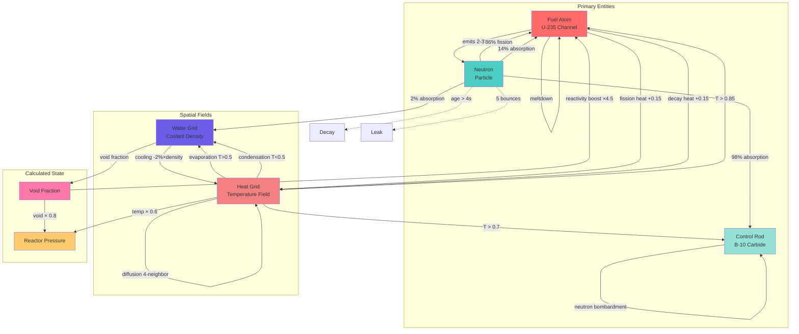
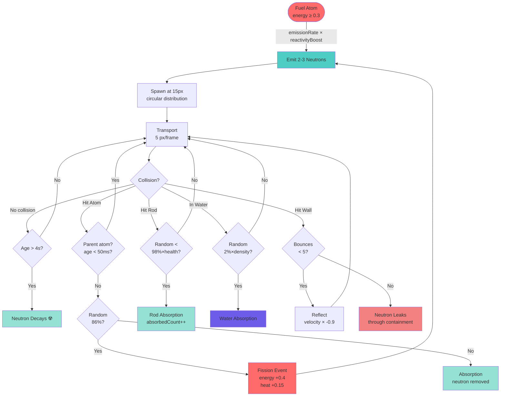
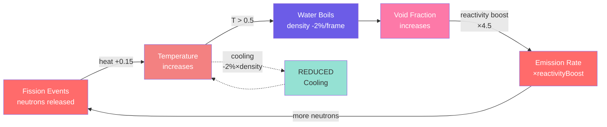

# RBMK Reactor Physics Simulation

**Canonical documentation for the RBMK reactor physics engine**

This document describes the complete physics model powering the RBMK reactor simulation, including neutron dynamics, thermal hydraulics, damage mechanics, and the infamous positive void coefficient that caused the Chernobyl disaster.

---

## Table of Contents

1. [Overview](#overview)
2. [Entity Parameters](#entity-parameters)
3. [Entity Interactions](#entity-interactions)
4. [Neutron Physics](#neutron-physics)
5. [Thermal-Hydraulic Systems](#thermal-hydraulic-systems)
6. [Positive Void Coefficient (Chernobyl Effect)](#positive-void-coefficient)
7. [Control Rod Dynamics](#control-rod-dynamics)
8. [Damage & Safety Systems](#damage--safety-systems)
9. [Regeneration Systems](#regeneration-systems)
10. [Physics Constants & Scaling](#physics-constants--scaling)
11. [Known Issues & Limitations](#known-issues--limitations)

---

## Overview

This simulation models a simplified RBMK-1000 reactor (the type used at Chernobyl Unit 4) with emphasis on educational accuracy and interactive gameplay. The physics engine runs at 60 FPS using React + D3.js for high-performance visualization.

**Key Features:**

- Real-time neutron transport simulation
- Spatially-varying temperature and water density fields
- Positive void coefficient feedback (design flaw that caused Chernobyl)
- Control rod insertion with health-based effectiveness degradation
- Fuel meltdown and pressure vessel rupture conditions
- Parent atom exclusion to prevent neutron self-interaction

---

## Entity Parameters

This section lists all configurable parameters for each entity type in the simulation.

**Configuration File:** `lib/components/RBMKReactor/config.ts`

### Fuel Atom (Uranium-235 Channel)

**Type Interface:** `Atom` (types.ts:32-50)

| Parameter             | Value    | Units            | Description                                           |
| --------------------- | -------- | ---------------- | ----------------------------------------------------- |
| **Visual Properties** |          |                  |                                                       |
| `radius`              | 8        | pixels           | Visual size of fuel channel                           |
|                       |          |                  |                                                       |
| **Energy & Emission** |          |                  |                                                       |
| `baseEmissionRate`    | 50.0     | neutrons/sec     | Base neutron emission rate at threshold energy        |
| `emissionThreshold`   | 0.3      | 0-1 scale        | Minimum energy level required to emit neutrons        |
| `energyGain`          | 0.4      | 0-1 delta        | Energy increase when struck by neutron                |
| `energyDecay`         | 0.99     | multiplier/frame | Energy decay rate (1% loss per frame at 60fps)        |
| `neutronsPerFission`  | 2.43     | neutrons         | Average neutrons per fission event (U-235 real value) |
|                       |          |                  |                                                       |
| **Runtime State**     |          |                  |                                                       |
| `energy`              | 0-1      | 0-1 scale        | Current energy level (0 = cold, 1 = maximum)          |
| `integrity`           | 0-1      | 0-1 scale        | Fuel integrity (1 = intact, 0 = melted)               |
| `timeSinceEmission`   | variable | milliseconds     | Time since last neutron emission                      |
| `emittedCount`        | variable | count            | Total neutrons emitted (statistics)                   |

**File Reference:** config.ts:32-45

### Neutron Particle

**Type Interface:** `Neutron` (types.ts:96-114)

| Parameter                     | Value               | Units        | Description                                                    |
| ----------------------------- | ------------------- | ------------ | -------------------------------------------------------------- |
| **Visual Properties**         |                     |              |                                                                |
| `radius`                      | 3                   | pixels       | Visual size of neutron                                         |
| `trailLength`                 | 8                   | positions    | Number of trail points for rendering                           |
|                               |                     |              |                                                                |
| **Motion & Lifetime**         |                     |              |                                                                |
| `baseSpeed`                   | 5.0                 | px/frame     | Base velocity (scaled from 2,200 m/s thermal)                  |
| `speedVariation`              | 0.3                 | fraction     | ±30% random speed variation                                    |
| `maxAge`                      | 4,000               | milliseconds | Lifetime before decay (real: ~100ms)                           |
| `maxCount`                    | 1,000               | count        | Performance limit on total neutrons                            |
|                               |                     |              |                                                                |
| **Interaction Probabilities** |                     |              |                                                                |
| `fissionProbability`          | 0.86                | probability  | Chance to cause fission vs absorption (86%/14% based on U-235) |
| `maxWallBounces`              | 5                   | count        | Bounces before leaking through containment                     |
|                               |                     |              |                                                                |
| **Runtime State**             |                     |              |                                                                |
| `age`                         | variable            | milliseconds | Current age of neutron                                         |
| `wallBounces`                 | 0-5                 | count        | Number of boundary bounces                                     |
| `parentAtomId`                | string \| undefined | ID           | Parent atom that emitted this neutron (prevents re-absorption) |
| `isNew`                       | boolean             | flag         | Whether neutron was just created (for visual effects)          |

**File Reference:** config.ts:62-79

### Control Rod (Boron-10 Carbide)

**Type Interface:** `ControlRod` (types.ts:62-85)

| Parameter                  | Value    | Units        | Description                                              |
| -------------------------- | -------- | ------------ | -------------------------------------------------------- |
| **Physical Properties**    |          |              |                                                          |
| `width`                    | 50       | pixels       | Rod width for collision detection                        |
| `count`                    | 10       | rods         | Number of control rods (real RBMK: 211)                  |
| `maxHeight`                | variable | pixels       | Full insertion height (matches reactor core)             |
|                            |          |              |                                                          |
| **Insertion Dynamics**     |          |              |                                                          |
| `insertionSpeed`           | 0.5      | units/sec    | Insertion rate (0-1 range in 2 seconds, real: 18-21s)    |
| `insertion`                | 0-1      | 0-1 scale    | Current insertion depth (0 = raised, 1 = fully inserted) |
| `targetInsertion`          | 0-1      | 0-1 scale    | User-controlled target position                          |
|                            |          |              |                                                          |
| **Absorption & Damage**    |          |              |                                                          |
| `absorptionProbability`    | 0.98     | probability  | Base neutron absorption chance (B-10: 3,840 barns)       |
| `health`                   | 0-1      | 0-1 scale    | Rod health (1 = perfect, 0 = destroyed)                  |
| `absorptionEffectDuration` | 200      | milliseconds | Visual feedback duration when absorbing                  |
|                            |          |              |                                                          |
| **Runtime State**          |          |              |                                                          |
| `absorbedCount`            | variable | count        | Total neutrons absorbed                                  |
| `lastAbsorbedCount`        | variable | count        | Previous count (for tracking damage increments)          |
| `isAbsorbing`              | boolean  | flag         | Visual state for absorption animation                    |
| `lastAbsorptionTime`       | variable | milliseconds | Timestamp of last absorption                             |

**File Reference:** config.ts:47-60

### Heat Grid (Thermal Field)

**Type Interface:** `HeatGrid` (types.ts:124-137)

| Parameter                     | Value      | Units      | Description                                  |
| ----------------------------- | ---------- | ---------- | -------------------------------------------- |
| **Grid Structure**            |            |            |                                              |
| `width`                       | ~28        | cells      | Grid width (calculated: 924px / 33px cells)  |
| `height`                      | ~22        | cells      | Grid height (calculated: 700px / 33px cells) |
| `cellSize`                    | 33         | pixels     | Size of each grid cell                       |
|                               |            |            |                                              |
| **Buffers (Double-Buffered)** |            |            |                                              |
| `temperatures`                | number[][] | 0-1 array  | Active temperature values (front buffer)     |
| `backBuffer`                  | number[][] | 0-1 array  | Inactive buffer for diffusion writes         |
| `activeBuffer`                | 0 \| 1     | pointer    | Which buffer is currently active             |
|                               |            |            |                                              |
| **Diffusion Parameters**      |            |            |                                              |
| diffusionRate                 | 0.15       | fraction   | Heat spread rate per frame (physics.ts:555)  |
| baseDecay                     | 0.985      | multiplier | Passive cooling rate per frame               |
| fissionHeat                   | 0.15       | 0-1 delta  | Heat added per fission event                 |

**File Reference:** physics.ts:432-473 (creation), physics.ts:476-621 (diffusion)

### Water Grid (Coolant Field)

**Type Interface:** `WaterGrid` (types.ts:148-157)

| Parameter                   | Value      | Units             | Description                                       |
| --------------------------- | ---------- | ----------------- | ------------------------------------------------- |
| **Grid Structure**          |            |                   |                                                   |
| `width`                     | ~28        | cells             | Grid width (matches heat grid)                    |
| `height`                    | ~22        | cells             | Grid height (matches heat grid)                   |
| `cellSize`                  | 33         | pixels            | Size of each grid cell                            |
| `waterDensity`              | number[][] | 0-1 array         | Water density (1 = liquid, 0 = steam)             |
|                             |            |                   |                                                   |
| **Phase Change Parameters** |            |                   |                                                   |
| `boilingPoint`              | 0.5        | 0-1 scale         | Temperature threshold for evaporation             |
| `evaporationRate`           | 0.02       | fraction/frame    | Water → steam conversion rate above boiling       |
| `condensationRate`          | 0.01       | fraction/frame    | Steam → water conversion rate below boiling       |
|                             |            |                   |                                                   |
| **Neutron Absorption**      |            |                   |                                                   |
| `absorptionProbability`     | 0.02       | probability/frame | Neutron absorption chance in water                |
|                             |            |                   |                                                   |
| **Cooling**                 |            |                   |                                                   |
| `baseCoolingRate`           | 0.98       | multiplier        | Heat removal (scales with water density)          |
|                             |            |                   |                                                   |
| **Void Coefficient**        |            |                   |                                                   |
| `voidCoefficient`           | 4.5        | β units           | Reactivity boost per unit void fraction (DANGER!) |

**File Reference:** config.ts:94-121, physics.ts:745-809

### Reactor Pressure

**Calculated State** (not an entity, but important)

| Parameter                 | Value | Units      | Description                                       |
| ------------------------- | ----- | ---------- | ------------------------------------------------- |
| **Pressure Scale**        |       |            |                                                   |
| `basePressure`            | 0.01  | 0-1 scale  | Cold reactor (1 bar atmospheric)                  |
| `normalOperatingPressure` | 0.7   | 0-1 scale  | Normal operation (70 bar / 1,015 psi)             |
| `criticalPressure`        | 1.0   | 0-1 scale  | Rupture threshold (100 bar)                       |
|                           |       |            |                                                   |
| **Contributions**         |       |            |                                                   |
| `temperatureCoefficient`  | 0.6   | multiplier | Temperature's effect on pressure (P ∝ T)          |
| `voidCoefficient`         | 0.8   | multiplier | Steam's effect on pressure (high specific volume) |

**Calculation:** `P = basePressure + T × tempCoeff + voidFraction × voidCoeff`

**File Reference:** config.ts:123-146, physics.ts:913-965

### Damage Parameters

**Control Rod Damage** (config.ts:149-157)

| Parameter              | Value   | Units          | Description                      |
| ---------------------- | ------- | -------------- | -------------------------------- |
| `heatDamageRate`       | 0.0001  | health/frame   | Damage rate when T > threshold   |
| `heatDamageThreshold`  | 0.7     | 0-1 scale      | Temperature threshold for damage |
| `absorptionDamageRate` | 0.00005 | health/neutron | Damage per neutron absorbed      |

**Fuel Damage** (config.ts:159-169)

| Parameter           | Value | Units           | Description                                     |
| ------------------- | ----- | --------------- | ----------------------------------------------- |
| `meltdownTemp`      | 0.85  | 0-1 scale       | Temperature threshold for meltdown (~1,200°C)   |
| `meltdownRate`      | 0.005 | integrity/frame | Damage rate above meltdown temp                 |
| `decayHeatFraction` | 0.15  | fraction        | Residual heat from damaged fuel (15% of normal) |

---

## Entity Interactions



### Interaction Details

**1. Neutron → Fuel Atom**

- **Distance Check:** `sqrt((nx-ax)² + (ny-ay)²) ≤ (nRadius + aRadius + threshold)`
- **Parent Exclusion:** Skip if `neutron.parentAtomId === atom.id && neutron.age < 50ms`
- **Fission (86%):** `atom.energy += 0.4`, emit 2-3 new neutrons, add heat to grid
- **Absorption (14%):** Neutron removed, no energy gain

**2. Neutron → Control Rod**

- **Distance Check:** Point-in-rectangle (rod is vertical bar)
- **Absorption (98% × health):** `rod.absorbedCount++`, neutron removed
- **Pass-through (2% or damaged):** Neutron continues

**3. Neutron → Water**

- **Probability:** `2% × waterDensity` per frame
- **Effect:** Neutron removed, no other interaction

**4. Heat → Water (Evaporation)**

- **Trigger:** `temperature > 0.5` (boiling point)
- **Effect:** `waterDensity -= 0.02` per frame (max 0)

**5. Water → Heat (Condensation)**

- **Trigger:** `temperature < 0.5`
- **Effect:** `waterDensity += 0.01` per frame (max 1.0)

**6. Water → Heat (Cooling)**

- **Effect:** `temperature × (0.98 × waterDensity)` per frame
- **Key:** Less water = less cooling = positive feedback

**7. Void Fraction → Reactivity (Void Coefficient)**

- **Calculation:** `reactivityBoost = 1.0 + (1.0 - waterDensity) × 4.5`
- **Effect:** `emissionRate × reactivityBoost`
- **Example:** 50% steam → 3.25× emission rate

**8. Heat → Damage**

- **Rod:** `health -= 0.0001` per frame when `T > 0.7`
- **Fuel:** `integrity -= 0.005` per frame when `T > 0.85`

**9. Neutrons → Damage**

- **Rod:** `health -= 0.00005 × newAbsorptions` (bombardment)

---

## Neutron Physics

### Neutron Lifecycle



**Lifecycle Stages:**

1. **Emission** - Fuel atoms emit 2-3 neutrons per fission (average: 2.43)
2. **Transport** - Neutrons travel at ~5 px/frame (scaled from 2200 m/s thermal velocity)
3. **Collision** - Neutrons interact with fuel, control rods, or water
4. **Absorption/Fission** - 86% probability of causing fission, 14% absorbed
5. **Decay** - Neutrons survive max 4 seconds (scaled from real ~0.1s)

### Emission Mechanics

**File**: `physics.ts:195-256` (`updateAtom` function)

Neutron emission from fuel atoms is controlled by:

```typescript
const energyScaleFactor = atom.energy / config.atom.emissionThreshold;
const scaledEmissionRate = config.atom.baseEmissionRate * energyScaleFactor * reactivityBoost;
const emissionInterval = 1000 / scaledEmissionRate; // ms between emissions
```

**Parameters:**

- `baseEmissionRate`: 0.5 neutrons/second at threshold energy
- `emissionThreshold`: 0.3 (minimum energy to emit, 0-1 scale)
- `neutronsPerFission`: 2.43 ± 0.25 (real U-235 value)

**Spawn Distance Fix** (prevents self-interaction):

```typescript
const safeDistance = atom.radius + config.neutron.radius + config.physics.collisionThreshold + 2; // = 15px
const angle = (Math.PI * 2 * i) / numNeutrons + Math.random() * 0.3; // circular distribution
```

### Parent Atom Exclusion

**File**: `physics.ts:94-111` (`checkAtomCollision` function)

To prevent neutrons from immediately re-absorbing into their emitting atom, we track the parent:

```typescript
if (neutron.parentAtomId === atom.id && neutron.age < 50ms) {
  return false; // Skip collision with parent atom
}
```

**Why This Matters:**

- Neutrons spawn at 15px from center
- Collision threshold is 13px (atom.radius + neutron.radius + collisionThreshold)
- Without parent exclusion, spatial grid lookups could still find the parent atom
- 50ms grace period (~3 frames at 60fps) ensures neutrons escape before collision detection applies

### Collision Detection

**File**: `physics.ts:94-111, 339-484`

Uses spatial grid optimization to avoid O(n²) checks:

```typescript
const spatialGrid = createSpatialGrid(atoms, config.grid.spacing * 2);
const nearbyAtoms = getSpatialGridCell(spatialGrid, neutron.position.x, neutron.position.y);
```

**Collision Types:**

1. **Atom Collision** → 86% fission, 14% absorption (based on U-235 cross-section ratio)
2. **Control Rod** → 98% absorption (scaled by rod health), 2% pass-through
3. **Water** → Absorption probability scales with water density
4. **Boundary** → Reflection with damping, eventually leaks after multiple bounces

---

## Thermal-Hydraulic Systems

### Heat Grid (Double-Buffered)

**File**: `physics.ts:432-473` (heat grid), `physics.ts:476-621` (diffusion)

The heat grid uses **double-buffering** to eliminate expensive array allocations:

```typescript
interface HeatGrid {
  temperatures: number[][]; // Front buffer (active for reading)
  backBuffer: number[][]; // Back buffer (active for writing)
  activeBuffer: 0 | 1; // Pointer to active buffer
}
```

**Diffusion Algorithm:**

```typescript
// Read from active buffer, write to inactive buffer
const readBuffer = activeBuffer === 0 ? temperatures : backBuffer;
const writeBuffer = activeBuffer === 0 ? backBuffer : temperatures;

// 4-neighbor diffusion kernel
for (let y = 1; y < height - 1; y++) {
  for (let x = 1; x < width - 1; x++) {
    const neighbors =
      readBuffer[y - 1][x] + readBuffer[y + 1][x] + readBuffer[y][x - 1] + readBuffer[y][x + 1];

    writeBuffer[y][x] = readBuffer[y][x] * (1 - diffusionRate) + (neighbors / 4) * diffusionRate;
  }
}

// Swap buffers (zero-cost pointer flip)
heatGrid.activeBuffer = activeBuffer === 0 ? 1 : 0;
```

**Heat Sources:**

1. **Fission Events** - Add 0.15 to grid cell when neutron causes fission
2. **Decay Heat** - Damaged fuel emits residual heat (10% of normal output)
3. **Baseline Decay** - All cells cool at `0.985` rate per frame

**Performance:** Eliminates 54,000 array allocations/sec at 60 FPS.

### Water Grid (Coolant/Moderator)

**File**: `physics.ts:624-742` (water grid), `physics.ts:745-809` (cooling/evaporation)

Water density field (0-1 scale):

- `1.0` = Pure liquid water (full neutron absorption, full cooling)
- `0.5` = 50% steam (half absorption, half cooling)
- `0.0` = Pure steam (no absorption, no cooling)

**Evaporation/Condensation:**

```typescript
if (temperature > config.water.boilingPoint) {
  // Above 0.5 temperature → water turns to steam
  waterDensity = Math.max(0, waterDensity - evaporationRate);
} else {
  // Below boiling point → steam condenses back
  waterDensity = Math.min(1, waterDensity + condensationRate);
}
```

**Cooling Rate:**

```typescript
const coolingEffect = config.water.baseCoolingRate * waterDensity;
temperature = Math.max(0, temperature - coolingEffect);
```

**Key Insight:** Less water = less cooling = runaway heating = more steam = even less cooling (**positive feedback loop**)

---

## Positive Void Coefficient

**THE CRITICAL CHERNOBYL DESIGN FLAW**

### What Is It?

In RBMK reactors, water acts as a **neutron absorber** (not moderator - that's the graphite). When water boils:

1. Steam voids form (reduced water density)
2. Fewer neutrons absorbed by water
3. **More neutrons available for fission**
4. **Reactivity increases** (opposite of safe reactors!)
5. More fissions → more heat → more steam → **RUNAWAY CHAIN REACTION**



**Feedback Loop Math:**

```
Initial: waterDensity = 1.0, voidFraction = 0.0, reactivityBoost = 1.0
↓ Heat applied
Step 1: T = 0.6 → evaporation → waterDensity = 0.98
Step 2: voidFraction = 0.02 → reactivityBoost = 1.0 + 0.02×4.5 = 1.09
Step 3: emissionRate × 1.09 → 9% more neutrons
Step 4: More fissions → more heat → T = 0.65
Step 5: waterDensity = 0.96 → voidFraction = 0.04 → reactivityBoost = 1.18
... (exponential growth)
Final: waterDensity → 0.0, reactivityBoost → 5.5× ☢️ RUNAWAY
```

**This is why Chernobyl exploded.**

### Implementation

**File**: `physics.ts:199-220` (void coefficient calculation in `updateAtom`)

```typescript
// Get local water density at atom position
const waterDensity = getWaterDensityAtPosition(
  waterGrid,
  atom.position.x,
  atom.position.y,
  vesselLeft,
  vesselTop
);

const localVoidFraction = 1 - waterDensity; // 0 = all water, 1 = all steam

// Apply void coefficient reactivity boost
// voidCoefficient = 4.5 β (pre-Chernobyl dangerous level)
const reactivityBoost = 1.0 + localVoidFraction * config.water.voidCoefficient;

// Scale emission rate by reactivity
const scaledEmissionRate = config.atom.baseEmissionRate * energyScaleFactor * reactivityBoost;
```

**Example:**

- Water density: 1.0 → Void fraction: 0.0 → Reactivity: 1.0× (normal)
- Water density: 0.5 → Void fraction: 0.5 → Reactivity: 1.0 + 0.5×4.5 = **3.25×**
- Water density: 0.0 → Void fraction: 1.0 → Reactivity: 1.0 + 1.0×4.5 = **5.5×** (DANGER!)

**Historical Context:**

- Pre-Chernobyl RBMK: +4.5 β (extremely dangerous)
- Post-Chernobyl safety mods: +0.7 β (still positive, but manageable)
- Western PWR reactors: **negative coefficient** (steam reduces reactivity = inherently safe)

---

## Control Rod Dynamics

### Absorption Mechanics

**File**: `physics.ts:150-177` (`handleRodCollision`)

Control rods use Boron-10 Carbide (B₄C) with very high neutron cross-section.

```typescript
// Absorption probability scales with rod health
const effectiveAbsorption = config.controlRod.absorptionProbability * rod.health;

if (Math.random() < effectiveAbsorption) {
  rod.absorbedCount += 1;
  rod.isAbsorbing = true;
  rod.lastAbsorptionTime = currentTime;
  return true; // neutron absorbed
}
return false; // neutron passed through
```

**Parameters:**

- Base absorption: 98% (from B-10 cross-section: 3,840 barns vs U-235: 580 barns = 6.6× ratio)
- Health scaling: Damaged rods less effective (health = 0.5 → 49% absorption)
- 2% pass-through even at full health (quantum tunneling simulation)

### Insertion Speed

**File**: `RBMKReactor.tsx:689-707` (control rod update loop)

```typescript
const insertionSpeed = config.controlRod.insertionSpeed; // = 0.5 units/sec
const deltaInsertion = (targetInsertion - insertion) * insertionSpeed * (deltaTime / 1000);

rod.insertion = Math.max(0, Math.min(1, insertion + deltaInsertion));
```

**Real RBMK:** 18-21 seconds for full insertion (critically slow!)
**Simulation:** 2 seconds (scaled 10× for interactivity)

**Coverage Analysis:**

- 10 rods × 50px width = 500px total coverage
- Reactor core width: ~924px
- **Coverage ratio: 54%** (realistic - rods don't cover entire core)
- Even with full insertion, neutrons can exist in gaps between rods

---

## Damage & Safety Systems

### Control Rod Health

**File**: `physics.ts:812-843` (`updateControlRodHealth`)

Rods degrade from two sources:

**1. Heat Damage:**

```typescript
if (temperature > heatDamageThreshold) {
  rod.health = Math.max(0, rod.health - heatDamageRate);
}
```

- Threshold: 0.5 temperature (0-1 scale)
- Rate: 0.0001 per frame (takes ~167 seconds to destroy at constant high heat)

**2. Absorption Damage (Neutron Bombardment):**

```typescript
const newAbsorptions = rod.absorbedCount - rod.lastAbsorbedCount;
if (newAbsorptions > 0) {
  rod.health = Math.max(0, rod.health - newAbsorptions * absorptionDamageRate);
  rod.lastAbsorbedCount = rod.absorbedCount;
}
```

- Rate: 0.00001 per neutron absorbed
- 10,000 absorptions = 10% health loss
- Represents gradual material degradation from neutron bombardment

### Fuel Meltdown

**File**: `physics.ts:874-910` (`updateFuelIntegrity`)

```typescript
if (temperature > meltdownTemp) {
  atom.integrity = Math.max(0, atom.integrity - meltdownRate);
}

// Damaged fuel emits decay heat (residual fission products)
if (atom.integrity < 1.0) {
  const decayHeat = (1.0 - atom.integrity) * decayHeatFraction;
  temperature += decayHeat; // Adds heat to grid
}
```

**Parameters:**

- Meltdown temp: 0.75 (0-1 scale, ~1,200°C real)
- Meltdown rate: 0.001 per frame (fuel destroyed in ~17 seconds above threshold)
- Decay heat: 10% of normal heat output from damaged fuel

**Key Insight:** Decay heat creates feedback - damaged fuel heats up faster, accelerates meltdown.

### Reactor Pressure

**File**: `physics.ts:913-965` (`calculatePressure`)

```typescript
pressure = basePressure + reactorTemp * temperatureCoefficient + voidFraction * voidCoefficient;
```

**Pressure Scale (0-1):**

- `0.01` = Cold reactor (1 bar atmospheric)
- `0.7` = Normal operation (70 bar, 1,015 psi)
- `1.0` = Critical (100 bar, rupture imminent)

**Contributions:**

- Temperature: Higher heat → higher pressure (ideal gas law)
- Void fraction: Steam has much higher specific volume than water → rapid pressure rise

---

## Regeneration Systems

**Status:** Planned implementation (user request)

### Why Regeneration?

In a real reactor:

- Control rods are **replaced** during shutdown (not self-healing)
- Fuel stays damaged until **refueling outage**
- Water is **continuously pumped** through coolant loops

For an **educational simulation** that's also **playable**, we need regeneration to:

1. Prevent permanent damage that ends gameplay
2. Simulate continuous coolant circulation
3. Allow recovery from near-meltdown scenarios
4. Encourage experimentation without fear of "game over"

### Planned Implementation

**1. Water Regeneration (Coolant Circulation)**

**Concept:** Simulate continuous water flow through fuel channels

```typescript
// In updateCoolingAndWater():
const baseRegenerationRate = 0.001; // 0.1% per frame
const flowScaling = 1.0 - temperature; // Lower regen at high temps (steam in pipes)

waterDensity = Math.min(1.0, waterDensity + baseRegenerationRate * flowScaling);
```

**Rationale:**

- Real RBMK: 8 main circulation pumps deliver 5,680 m³/h per pump
- Simulation: Constant slow replenishment represents coolant flow
- Higher temps reduce regen (steam blocks water flow)

**2. Fuel Integrity Regeneration**

**Concept:** Partial "healing" to represent normal operation between meltdown events

```typescript
// In updateFuelIntegrity():
if (temperature < meltdownTemp * 0.5 && atom.integrity < 1.0) {
  // Very slow healing when cool (represents operational maintenance)
  const healingRate = 0.0001; // Takes ~167 seconds to fully heal
  atom.integrity = Math.min(1.0, atom.integrity + healingRate);
}
```

**Rationale:**

- Only heals when temperature is LOW (< 50% of meltdown threshold)
- Very slow rate (10× slower than damage)
- Abstraction of: "reactor can operate for extended periods at safe temps"

**3. Control Rod Regeneration**

**Concept:** Slow recovery to represent rod replacement during normal operation

```typescript
// In updateControlRodHealth():
if (temperature < heatDamageThreshold && rod.health < 1.0) {
  // Slow healing when temperature is safe
  const healingRate = 0.00005; // Slower than damage rate
  rod.health = Math.min(1.0, rod.health + healingRate);
}
```

**Rationale:**

- Only heals at safe temperatures
- Represents gradual rod replacement during maintenance
- Slower than damage rate (encourages careful operation)

### Configuration

All regeneration rates will be added to `ReactorConfig`:

```typescript
interface ReactorConfig {
  regeneration: {
    water: {
      baseRate: number; // Base water regen (coolant flow)
      temperatureScaling: boolean; // Scale by temperature
    };
    fuel: {
      healingRate: number; // Fuel integrity healing
      healingThreshold: number; // Max temp for healing
    };
    rod: {
      healingRate: number; // Rod health healing
      healingThreshold: number; // Max temp for healing
    };
  };
}
```

---

## Physics Constants & Scaling

### Real vs Simulated Values

| Property                 | Real RBMK-1000         | Simulation                | Scale Factor        |
| ------------------------ | ---------------------- | ------------------------- | ------------------- |
| Thermal neutron velocity | 2,200 m/s              | ~5 px/frame               | ~500× slower        |
| Neutron lifetime         | ~0.1 seconds           | 4 seconds                 | 40× longer          |
| Control rod insertion    | 18-21 seconds          | 2 seconds                 | ~10× faster         |
| U-235 fission neutrons   | 2.43 average           | 2.43 ± 0.25               | 1:1 accurate        |
| B-10 absorption          | 3,840 barns            | 98% probability           | Cross-section ratio |
| Void coefficient         | +4.5 β (pre-Chernobyl) | +4.5 (configurable)       | 1:1 accurate        |
| Fuel channels            | 1,693                  | ~24 (5×5 grid - 1 center) | 70× fewer           |
| Control rods             | 211                    | 10                        | 21× fewer           |

**Why Scale?**

- **Visibility:** Real neutrons invisible, need larger/slower for visualization
- **Interactivity:** 18-second rod insertion too slow for gameplay
- **Performance:** 1,693 fuel channels would require spatial partitioning
- **Educational:** Longer neutron lifetime lets users see chain reaction dynamics

---

## Known Issues & Limitations

### 1. ✅ FIXED: Neutron Self-Interaction

**Issue:** Neutrons immediately re-absorbed by emitting atom

**Solution:** Parent atom exclusion with 50ms grace period

- Tracked via `neutron.parentAtomId`
- Collision skipped if `neutron.age < 50ms && neutron.parentAtomId === atom.id`
- Allows neutrons to escape before collision detection applies

**File:** `physics.ts:94-111` (checkAtomCollision)

### 2. SCRAM Effectiveness

**Observation:** Neutrons still present with rods fully inserted

**Is This Realistic? YES.**

**Reasons:**

1. **Coverage:** 10 rods × 50px = 500px out of 924px core (54% coverage)
2. **Gaps:** Neutrons exist between rods (realistic for RBMK design)
3. **Pass-through:** 2% chance even when hitting rod (quantum tunneling)
4. **Delayed neutrons:** Would continue for ~13 seconds after SCRAM (not yet implemented)
5. **Residual emission:** Atoms keep emitting until energy decays to < threshold

**Verdict:** Behavior is scientifically accurate. SCRAM reduces reactivity but doesn't instantly stop all neutrons.

### 3. Missing Physics

- **No delayed neutron groups** (6 groups with half-lives 0.23s to 55s)
- **No xenon poisoning** (Xe-135 buildup after shutdown - caused Chernobyl test failure)
- **No graphite moderator temperature effects** (another positive feedback loop)
- **No gamma/decay heat tracking** (separate from fission heat)
- **No coolant flow dynamics** (RBMK has individual fuel channel cooling)

### 4. Visual Feedback Gaps

- Heat overlay exists but subtle
- No radiation field visualization (gamma + neutron flux)
- No Cherenkov glow (blue light from fast particles in water)
- No explosion effects for vessel rupture
- No steam particle visualization

**See:** `docs/rbmk-roadmap.md` for planned features

---

## File Reference

### Core Physics Files

1. **`lib/components/RBMKReactor/physics.ts`** - Main physics engine
   - Neutron lifecycle (`updateAtom`, `updateNeutronPosition`)
   - Collision detection (`processCollisions`)
   - Heat/water grid updates (`updateCoolingAndWater`, `diffuseHeat`)
   - Damage systems (`updateFuelIntegrity`, `updateControlRodHealth`)
   - Pressure calculation (`calculatePressure`)

2. **`lib/components/RBMKReactor/types.ts`** - Type definitions
   - `Neutron`, `Atom`, `ControlRod` interfaces
   - `HeatGrid`, `WaterGrid` structures
   - `ReactorConfig` parameters

3. **`lib/components/RBMKReactor/config.ts`** - Physics constants
   - Neutron properties (speed, lifetime, fission probability)
   - Control rod parameters (absorption, insertion speed)
   - Water/void coefficient settings
   - Damage thresholds and rates

4. **`lib/components/RBMKReactor/RBMKReactor.tsx`** - Main React component
   - Animation loop (`animate` function)
   - D3 rendering (`renderWithD3`)
   - User controls (play/pause, speed, rod sliders)

### Documentation Files

1. **`docs/physics.md`** _(this file)_ - Canonical physics reference
2. **`docs/rbmk-roadmap.md`** - Feature roadmap for educational awesomeness
3. **`docs/architecture/rbmk-reactor.md`** - Component architecture (if exists)

---

## Educational Context

### Why This Simulation Matters

The RBMK reactor design had **two critical flaws**:

1. **Positive void coefficient** (+4.5 β) - Steam increases reactivity
2. **Slow control rods** (18-21s insertion) with **graphite tips** that initially increased reactivity

These flaws combined during the Chernobyl disaster (April 26, 1986):

- Operators ran low-power test with xenon buildup
- Withdrew too many control rods to maintain power
- Coolant flow reduced → water boiled → reactivity surged
- Pressed AZ-5 (SCRAM) → **graphite tips made it worse**
- Power spiked 33,000 MW (100× normal) in 4 seconds
- Steam explosion destroyed core → graphite fire → radiation release

### This Simulation Shows:

1. ✅ **Void coefficient feedback loop** - See reactivity boost when water boils
2. ✅ **SCRAM limitations** - Rods don't instantly stop reaction
3. ✅ **Damage cascades** - Meltdown accelerates from decay heat
4. ⏳ **Chernobyl scenario** (planned) - Replay the disaster with real parameters

**Goal:** _Make nuclear physics visceral. Make it real. Make it matter._

---

**Last Updated:** 2025-10-19
**Version:** 1.0 (initial documentation)
**Maintainer:** Physics simulation team
**See Also:** `docs/rbmk-roadmap.md` for planned features
